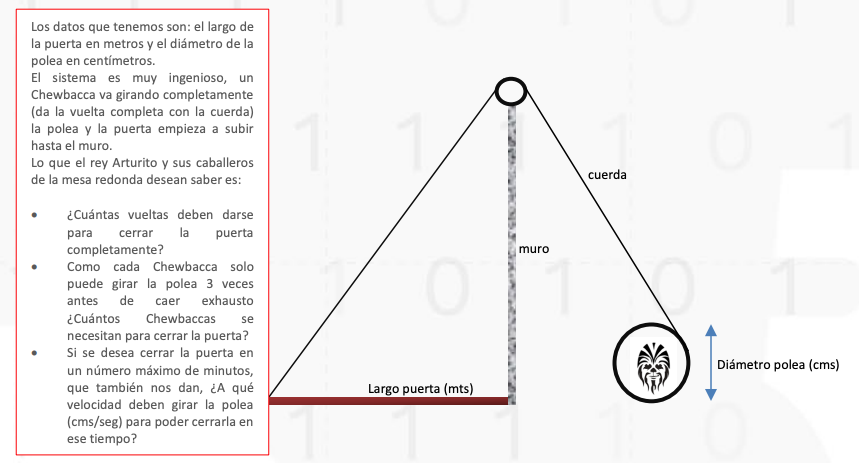

# RETO SEMANA 2
### Puerta del Castillo
El rey Arturito (antecesor de R2D2), está muy preocupado porque le han informado que el ejército Vaderiano está muy cerca de su castillo con la idea de atacarlo.
 El castillo se
encuentra realmente muy bien protegido por murallas y cañones, pero su talón de Aquiles
es la gran puerta del castillo, que solo se puede cerrar bajo ataque, porque por allí entran
víveres, productos y medicinas.
El problema es que se demoran mucho para cerrarla ya que esto se hace empujándola de
abajo hacia arriba por los soldados Chewbaccas, que a pesar de su fuerza, en ocasiones no
alcanzan a cerrarla completamente y el castillo es saqueado.
A oídos del rey ha llegado un plano elaborado por un tal Arquímedes (se sospecha que es
un seudónimo) donde le plantea una solución al problema aunque no da muchos detalles.
Aquí reproducimos el dibujo y las instrucciones
